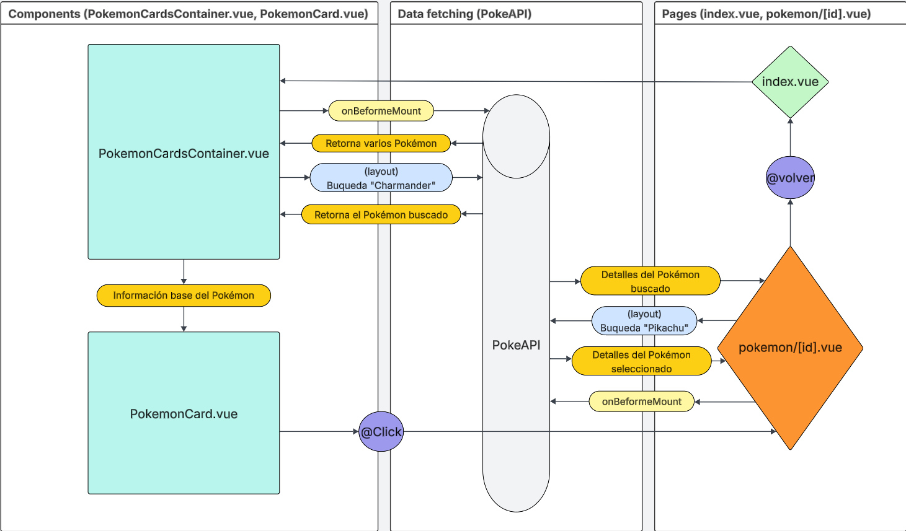

# 🧬 PokéDex Web App

Aplicación web moderna construida con **Nuxt 3** que explora el fascinante mundo de Pokémon a través de la **[PokeAPI](https://pokeapi.co/)**. Esta implementación sigue principios de arquitectura escalable, incorpora buenas prácticas de desarrollo frontend y cuenta con pruebas automatizadas para garantizar la calidad del código.

---

## 📦 Tabla de Contenidos

- 🔧 Requisitos
- 🚀 Instalación
- 🛠️ Tecnologías Utilizadas
- 📁 Estructura del Proyecto
- 📝 Decisiones Técnicas
- 🌿 Estructura de Ramas
- 🧩 Arquitectura y Patrones de Diseño
- 📊 Manejo de Estados y Errores
- 📐 Diagrama de Componentes
- 👨‍💻 Guía para Desarrollador@s
- 🔮 Posibles Mejoras Futuras

---

## 🔧 Requisitos

Version de Node recomendada: **v23.11.0**

---

## 🚀 Instalación

```bash
# Clonar el repositorio
git clone https://github.com/AndresFilatCoder/pokemon.git

# Navegar al directorio del proyecto
cd pokemon

# Instalar dependencias
npm install

# Iniciar servidor de desarrollo
npm run dev
```

Para ejecutar las pruebas unitarias:
```bash
npm run test
```

---

## 🛠️ Tecnologías Utilizadas

Nuxt 3
Framework progresivo basado en Vue 3 que facilita el desarrollo de aplicaciones SSR, SSG e híbridas con estructura modular, configuración por convención y excelente rendimiento, perfecto para crear aplicaciones web modernas y escalables.

TypeScript
Lenguaje de tipado estático que mejora la mantenibilidad del código, previene errores en tiempo de desarrollo y facilita el trabajo colaborativo en proyectos medianos y grandes.

SCSS (Sass)
Preprocesador de CSS utilizado para mantener estilos organizados, escalables y reutilizables, permitiendo el uso de variables, mixins, funciones y anidamiento.

PostCSS
Herramienta para transformar CSS con plugins. En este proyecto se utiliza con:
- **autoprefixer**: añade automáticamente prefijos para compatibilidad entre navegadores
- **postcss-custom-media**: permite definir media queries reutilizables para mejorar la legibilidad y mantener reglas responsivas limpias

Bootstrap 5
Framework CSS que facilita la creación de interfaces modernas y responsivas con su sistema de grid, clases utilitarias y estilos prediseñados. Perfecto para diseños rápidos y robustos.

Iconify
Librería que facilita la implementación de una gran variedad de iconos, los cuales se pueden personalizar en cuanto a color, tamaño, etc.

Vitest
Framework de pruebas moderno y veloz diseñado para trabajar con Vite/Nuxt. Permite pruebas unitarias e integración fácilmente configurables, con informes de cobertura y compatibilidad con herramientas de CI

---

## 📁 Estructura del Proyecto
```markdown
├── assets/                    # Archivos estáticos como imágenes y estilos globales
├── components/                # Componentes reutilizables (botones, cards, loaders)
├── composables/               # Composables de Vue 3 (lógica compartida entre componentes)
├── interfaces/                # Interfaces de TypeScript para definir tipos y estructuras
├── layouts/                   # Plantillas reutilizables y fáciles de implementar
├── pages/                     # Páginas como Home (index.vue) y detalles de Pokémon
├── plugins/                   # Plugins personalizados (SEO, transformación de texto)
├── public/                    # Archivos públicos como imágenes y fuentes
├── services/                  # Servicios que interactúan con la API
├── tests/                     # Pruebas unitarias
├── utils/                     # Funciones utilitarias
└── nuxt.config.ts             # Configuración de Nuxt 3
```

---

## 📝 Decisiones Técnicas

* Uso de Nuxt 3: Se eligió Nuxt 3 por su arquitectura optimizada, integración automática con Vue 3 y su soporte nativo para SSG/SSR. Esto permite una carga rápida de la página y una mejor experiencia de usuario.

* Uso de Bootstrap: Utilizamos Bootstrap 5 para acelerar el desarrollo de la interfaz responsiva, centrándonos en su sistema de grid y componentes básicos.

* Uso de Iconify: Se implementó Iconify para implementar de forma sencilla y rápida iconos flexibles, permitiendo una implementación rápida, robusta y limpia.

* PostCSS: La configuración de PostCSS con plugins como autoprefixer y postcss-custom-media permite manejar los estilos de forma eficiente, mejorando la compatibilidad entre navegadores y haciendo que los estilos sean más mantenibles.

* Manejo de Estado y Errores: La aplicación maneja los estados de carga, error y éxito de forma visual utilizando componentes de carga y mensajes de error, lo que mejora la experiencia del usuario.

* Uso de Servicios: Se implementaron servicios como (services/PokemonService.ts, PokemonDetailsService.ts) para abstraer la lógica de consumo de la API y mantener los componentes lo más limpios posible. Esto permite una separación clara de responsabilidades y facilita el testeo y mantenimiento del código.

* Uso de Composables: Se utilizaron composables (composables/useSearch.ts, usePokemonStats.ts, useFilat.ts, useSocialNetworks.ts) para extraer lógica reutilizable y mantener los componentes enfocados en la presentación. Esta técnica permite mayor modularidad, facilidad de pruebas y legibilidad del código.

* Uso de useFetch() implícito dentro de "useFilat()" (Custom Fetching): Se usa useFetch() para SSR con caché.

* Elección de API: Se eligió "PokeAPI" por su simplicidad y datos claros.

---

## 🌿 Estructura de Ramas

**main**: rama de producción

**develop**: rama de desarrollo

**feature/<feature-name>**: ramas para cada nueva funcionalidad

**testing**: rama para gestionar las pruebas unitarias

---

## 🧩 Arquitectura y Patrones de Diseño

**Factory Pattern (implícito)**: En los servicios se podría extender fácilmente a múltiples endpoints o entidades, generando diferentes factories para diferentes recursos de la API.

**Composables**: A través de los composables, se reutiliza y comparte lógica entre componentes sin duplicación de código.

**Separation of Concerns (SoC)**: Cada carpeta y archivo cumple un propósito específico. La lógica de red está separada de la lógica visual, que a su vez está separada de los tipos, estilos y helpers.

**Presentational vs Container Components**: Los componentes están diseñados para diferenciar entre quienes manejan la lógica y quienes se encargan exclusivamente del renderizado.

**Plugin Pattern**: Se usa para extender Nuxt con funcionalidades globales reutilizables como (v-capitalize, seo.global.ts).

---

## 📊 Manejo de Estados y Errores

* **useFetch** y **try/catch** para capturar errores en llamadas a API.

* Visualización de estados: Loading..., No data, Error con feedback al usuario.

* Página para manejo de errores como 404 Not Found

---

## 📐 Diagrama de Componentes



---

## 👨‍💻 Guía para Desarrollador@s

Esta guía está diseñada para facilitar la comprensión, extensión y mantenimiento del proyecto por parte de nuevos desarrolladores.

**Estructura Clave del Proyecto**

📁 **pages/** - Define las vistas principales de la app.

📁 **components/** - Contiene componentes visuales reutilizables.

📁 **layouts/** - Define la estructura base de las páginas (header, footer, etc.).

📁 **composables/** - Lógica reutilizable desacoplada de la vista, usando Composition API.

📁 **services/** - Lógica de acceso a API's y retorno de datos.

📁 **interfaces/** - Tipado TypeScript para todas las entidades utilizadas.

📁 **utils/** - Funciones utilitarias, como audio, filtros, etc.

📁 **plugins/** - Funciones globales para Vue/Nuxt como directivas personalizadas y configuraciones de SEO.

📁 **assets/** - Estilos globales (SCSS) y variables de color.

📁 **public/** - Archivos estáticos publicos como imágenes, fuentes, gifs, etc.

📁 **tests/unit/** - Pruebas unitarias con Vitest.


🧩 **Tener en cuenta antes de añadir una Nueva Funcionalidad**

1. Crear un Servicio en **services/** para manejar llamadas a la API.

2. Definir Tipos en **interfaces/** si se utilizan nuevas estructuras de datos.

3. Crear un Composable para lógica de negocio reutilizable o relacionada con el estado.

4. Construir uno o más Componentes si se necesita representación visual (Separation of Concerns).

5. Agregar una nueva Página en **pages/** si se requiere una ruta específica.

6. Agregar Pruebas unitarias en **tests/unit/** relacionadas con el nuevo comportamiento.

---

## 🔮 Posibles Mejoras Futuras

🔧 Optimización de rendimiento: Implementar lazy loading en imágenes y recursos pesados.

🔧 Carga de imágenes y documentos: Solicitar recursos directamente de S3 para liberar peso y optimizar aún más la carga de recursos estáticos.

🔧 Ampliar las funcionalidades: Agregar un sistema de favoritos, donde los usuarios puedan guardar sus Pokémon preferidos.

🔧 Scroll infinito: Permitir cargar más Pokémon cuando se hace scroll usando la paginación de la PokeAPI (https://pokeapi.co/api/v2/pokemon?limit=10&offset=0).
